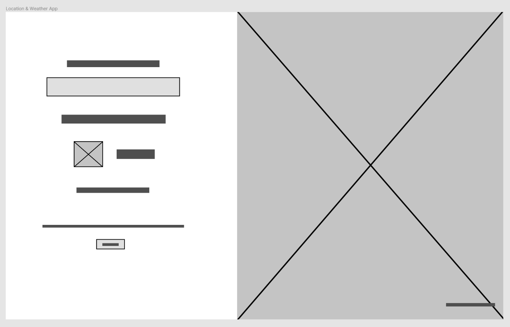

# Location and Weather Application

My first app is going to be the location and weather app.
To open the app run the follwing commands in the `weather-app/` directory.

1. `npm i` to install the dependencies.
2. `npm run build` to build the React App.
3. `npm run electron` to run the built React App in an electron desktop window.

## API Keys

The keys are hard-coded, if they don't work use the ones below.

### Open Weather Map
**App ID:** `c3f026dd0dd061ca6e0316792f68400e`  
Will be added into `weather-app/src/App.jsx` line `10`.

### Unsplash

**App ID:** `b564c9e1c812ab8af76d47abe7031f1acf82c87adfb486025fecb84f6252ea14`  
Will be added into `weather-app/src/App.jsx` line `6`.

**Secret:** `2094838e590ea5496f25152e86dce356e7f498aa63f33218768bf002b48ee9ba`  
Will be added into `weather-app/src/App.jsx` line `7`.

## Choice of framework

The framework I decided to go with for the location and weather application is Electron. I chose this Microsoft owned framework due to it being web-based, and being able to work with front-end web technologies such as ReactJS, which is also what I am using in this application.

Electron was easy for me to use as I have much more experience with web farmeworks and JavaScript. This makes the development much easier to create and maintain the application over time. https://dzone.com/articles/what-is-electron-amp-why-should-we-use-it.

Pulling in JSON style APIs are easy to use in JavaScript frameworks, as the objects can be fetched asyncronously and used directly (without models) which will be helpful with the location and weather data being pulled in constantly while the user types in a city.

For a location and weather application ReactJS makes it easy to update the weather and images on the fly with just having to update the `state`. This makes it easy to change elements on the screen by using `setState()` to update the property and the DOM together. This means that I can continuously pull down data and update it asyncronously and quickly using ReactJS.

JavaScript is one of the easiest languages to use, and has major support in place, as it is the most widely used language in progamming at the moment. ReactJS is a framework on top of JavaScript which makes it even easer to use events and DOM updating on single page applications, which would work great for the design of this location and weather applicaition. https://brainhub.eu/blog/electron-desktop-app/.

There are some issues with electron where it uses a lot more memory and the performance isn't as fast as a native applications. Yet, this will not be a major issue with the weather application as it is a small application with only one input, one image and simple weather information; which doesn't require much computer resources. https://medium.com/commitlog/electron-is-cancer-b066108e6c32.

Using web-based styling also allows for easy styling with CSS grids. This give a much greater range of styling attributes to use, and a similer and familiar language. This makes the site look and feel much nicer for the end user, and can be easily made responsive, with resizing of the application.

## Wireframe

